# DeblurGANv2-PyTorch

## 1 Training

- Python 3.6
- PyTorch 1.0 with Cuda 8.0
- OpenCV

## 2 Training

Please change the path parameter to your dataset path. Then run `train_pre.sh` or `train_all.sh`:

```bash
sh train_pre.sh
or
sh train_all.sh
```

## 3 Validation

```bash
python validation.py
```

## 4 Pre-trained models

[Onedrive link](https://portland-my.sharepoint.com/:f:/g/personal/yzzhao2-c_my_cityu_edu_hk/EvghwTdReyxIl8ccqJc6IVIBwSZXxxTHBXoNuab1M3d1Nw?e=vq2EQf) includes logs, models, and trained_models.

## 5 Samples

input-generated-ground truth

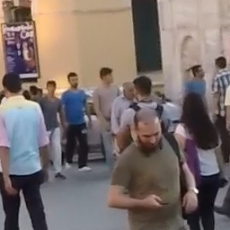


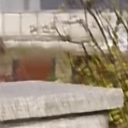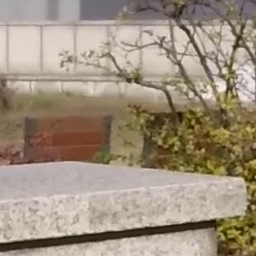

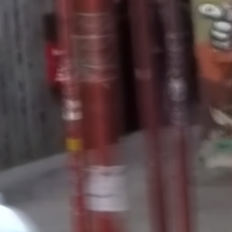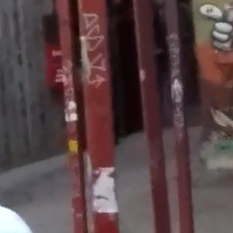

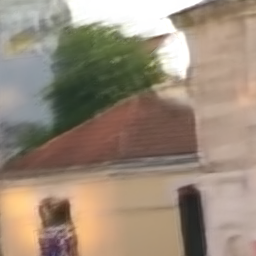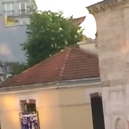


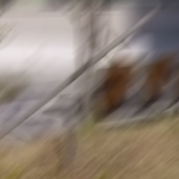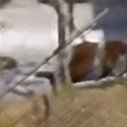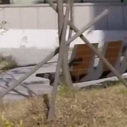

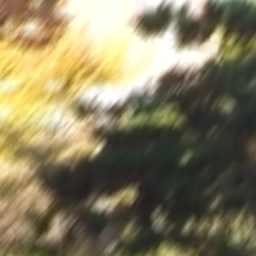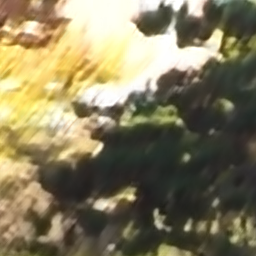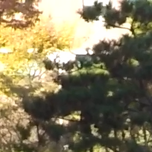

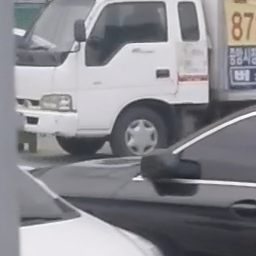

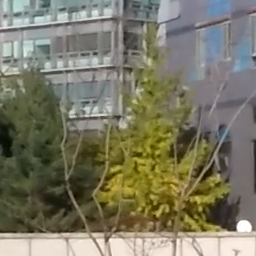

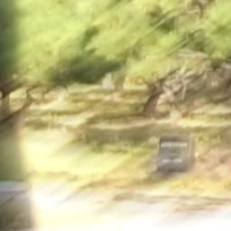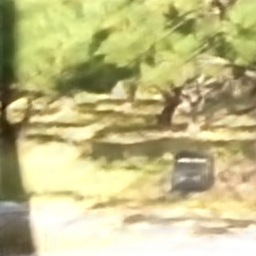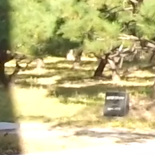


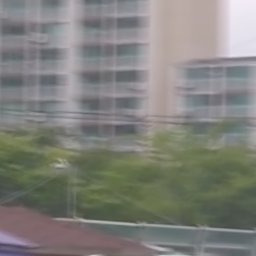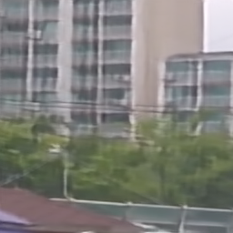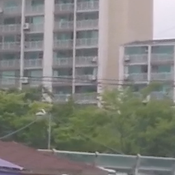


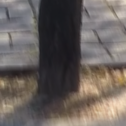


